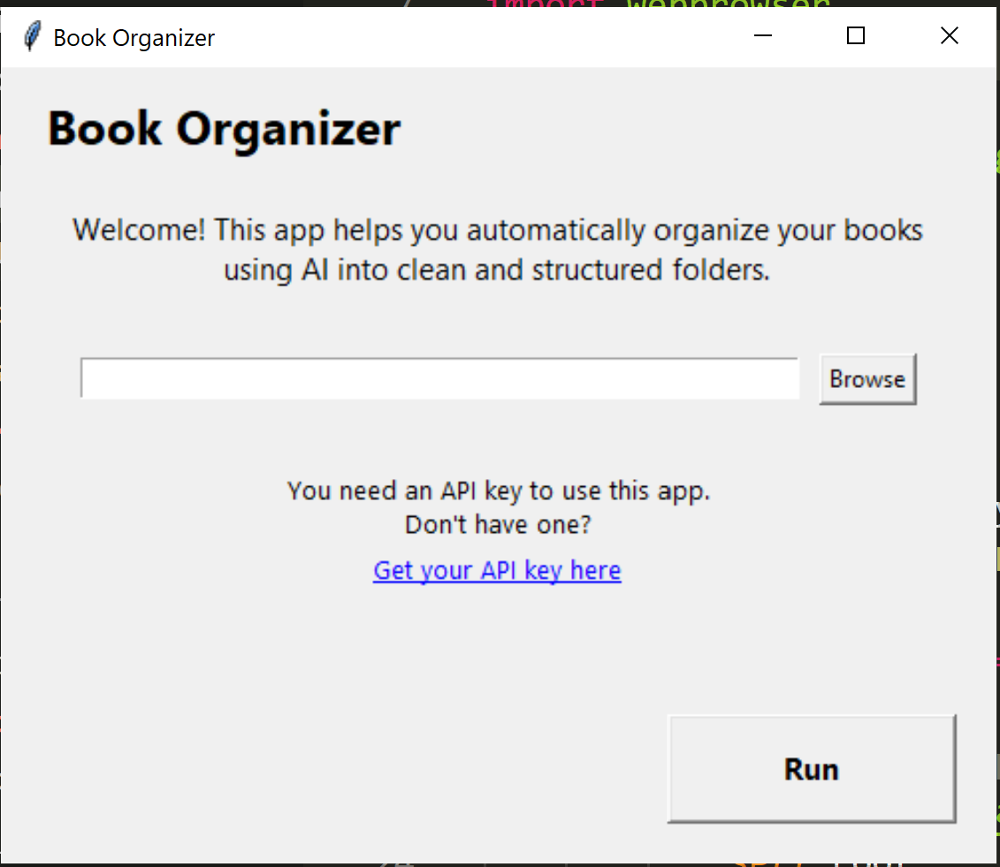

# 📚 Book Organizer with AI

A Python application that automatically organizes your book files into categories using AI.

Built with:
- 🐍 Python
- 🧠 OpenAI API
- 🖥️ Tkinter (GUI)
- 📂 pathlib (file management)

---


## ✨ Features

- Select a folder containing book files
- Automatically scans all files (recursive)
- Uses AI to classify books into categories
- Organizes files into structured folders
- Avoids duplicate files
- Simple and user-friendly interface

---

## How it works

1. Select your books folder
2. The app reads all file names
3. Sends them to an AI model
4. Receives categorized results
5. Organizes files into folders automatically

---

## Installation

1. Clone the repository:

```bash
git clone https://github.com/your-username/book-organizer.git
cd book-organizer
```

2. Create and activate a virtual environment:
```bash
python -m venv venv
venv\Scripts\activate   # Windows
```

3. Install dependencies:
```bash
pip install -r requirements.txt
```

##🔑 API Key Setup

This app requires an OpenAI API key.

You can get one here:
👉 [OpenAI Platform](https://platform.openai.com/)

Set your API key as an environment variable:

### Windows (PowerShell)
```bash
setx OPENAI_API_KEY "your_api_key_here"
```

### Linux / Mac
```bash
export OPENAI_API_KEY="your_api_key_here"
```

##▶️ Usage

Run the application:
```bash
python main.py
```
Then:



-Select your books folder
-Click Run
-Let the app organize everything for you

##📁 Project Structure
```bash
Book_Organizer/
│
├── main.py          # GUI (Tkinter)
├── file_manager.py  # File operations
├── ai_client.py     # OpenAI API communication
├── .gitignore
├── README.md
└── requirements.txt
```

##⚠️ Important Notes

Create a copy of the file you are going to be working with beforehand just in case
The app moves files, so use it carefully
Duplicate files are ignored (not overwritten)

##🔮 Future Improvements

🔑 API key input field in the GUI
⚙️ Customizable AI prompt (user-defined categories)
🔄 Re-organize already classified folders
📊 Progress bar and status feedback
🎨 Improved UI/UX (modern design, dark mode)
📂 Support for more file metadata (not only filename)
🧪 Add tests
📦 Export as executable (.exe)

##🤝 Contributing

This is a learning project, but contributions and ideas are welcome.

##📜 License

MIT License
